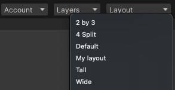
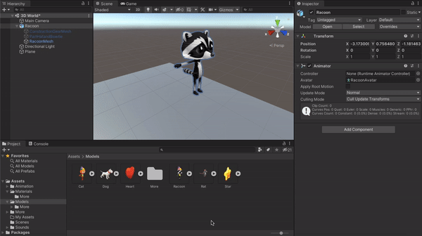
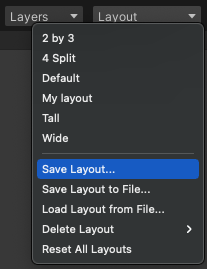

You can customise the Unity editor to have the layout that is easiest for you to navigate. 

Unity has a number of predefined layouts that you can chose from by clicking on the **Layout** dropdown box and selecting your chosen view. 

You can customise these layouts by clicking on the tab at the top of any of the Scene view and Game view, or Hierachy, Project and Inspector windows and dragging them to a new position. 

After customising a layout you can save it to use again later by clicking on the **Layout** dropdown box and selecting **Save Layout...**.

